# Optimizer Agent Architecture

## System Overview

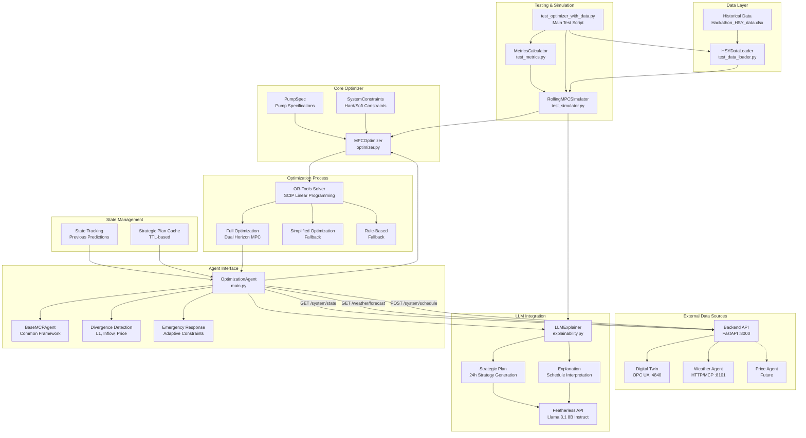

## Optimization Flow

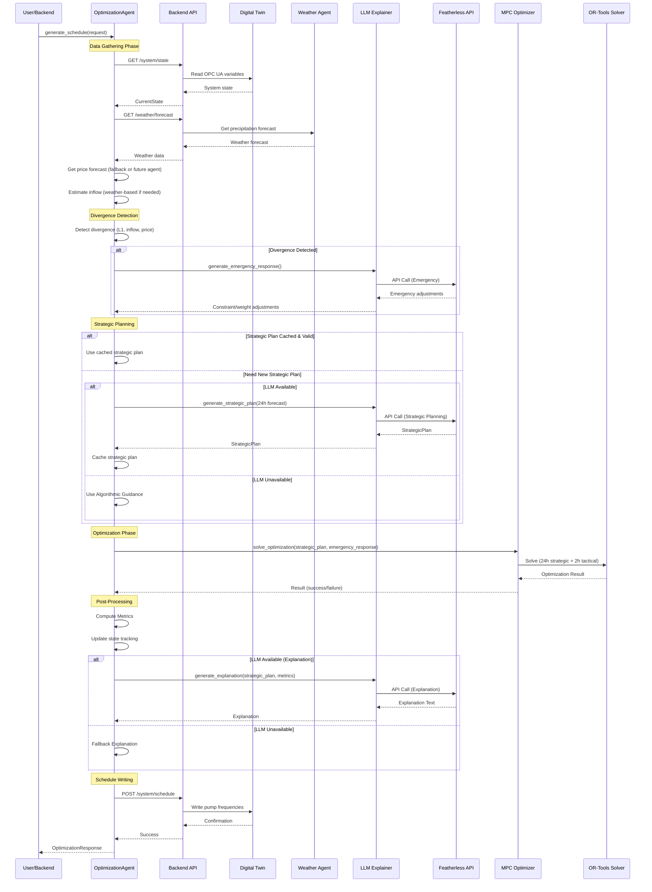

## Rolling MPC Simulation Flow

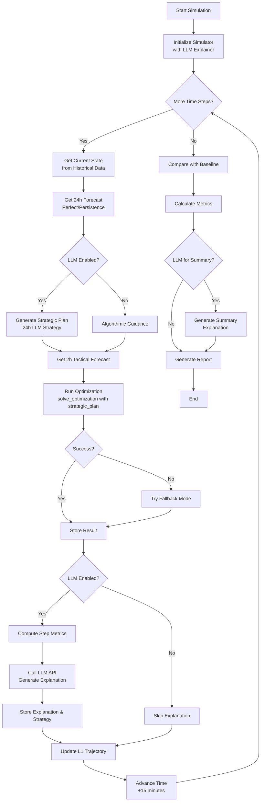

## Component Relationships

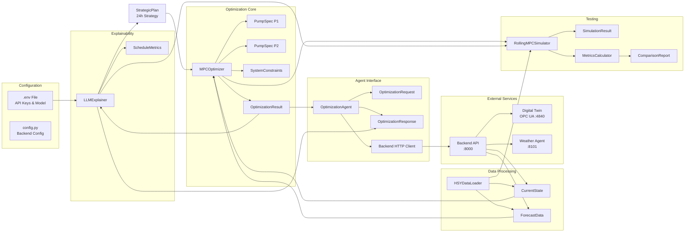

## Data Structures

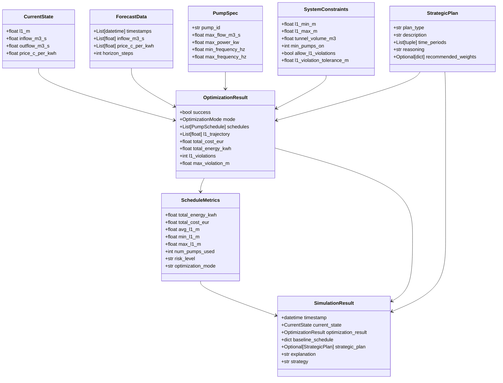

## File Structure

```
optimizer_agent/
├── main.py                    # OptimizationAgent (Integrated with Backend)
│                              # - Backend integration (HTTP client)
│                              # - Digital twin state reading
│                              # - Weather agent integration
│                              # - Divergence detection
│                              # - Emergency response
│                              # - State tracking
│                              # - Schedule writing to digital twin
├── optimizer.py               # MPCOptimizer (Core Optimization Engine)
│                              # - Dual-horizon MPC (24h strategic + 2h tactical)
│                              # - Pump fairness/rotation
│                              # - Multiple objectives (cost, smoothness, safety)
│                              # - Fallback modes (simplified, rule-based)
├── explainability.py          # LLMExplainer (Featherless Integration)
│                              # - Strategic plan generation (24h)
│                              # - Schedule explanation
│                              # - Emergency response generation
│
├── test_data_loader.py        # HSYDataLoader (Historical Data Loading)
├── test_simulator.py          # RollingMPCSimulator (MPC Simulation)
│                              # - Divergence detection in simulation
│                              # - Emergency response testing
├── test_metrics.py            # MetricsCalculator (Performance Metrics)
├── test_optimizer_with_data.py # Main Test Script
│
├── .env                       # Agent Configuration (API Keys)
├── ARCHITECTURE.md            # This file
├── ALL_CONSTRAINTS.md          # Complete constraints documentation
├── CONSTRAINTS_INVENTORY.md    # Constraints inventory
└── ARCHITECTURE_TREE.txt      # Component tree structure
```

## Optimization Modes

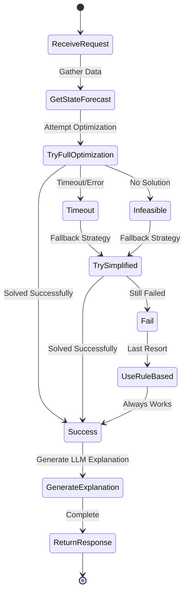

## LLM Strategic Plan Flow

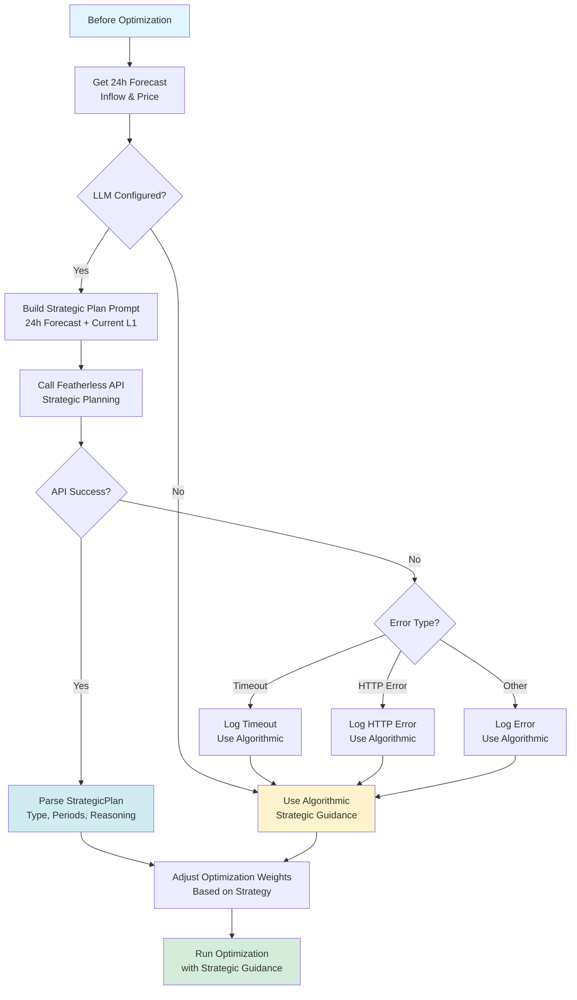

## LLM Explanation Flow

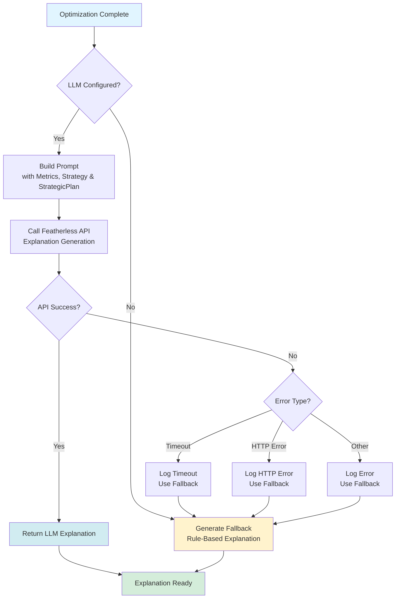

## State Tracking & Caching

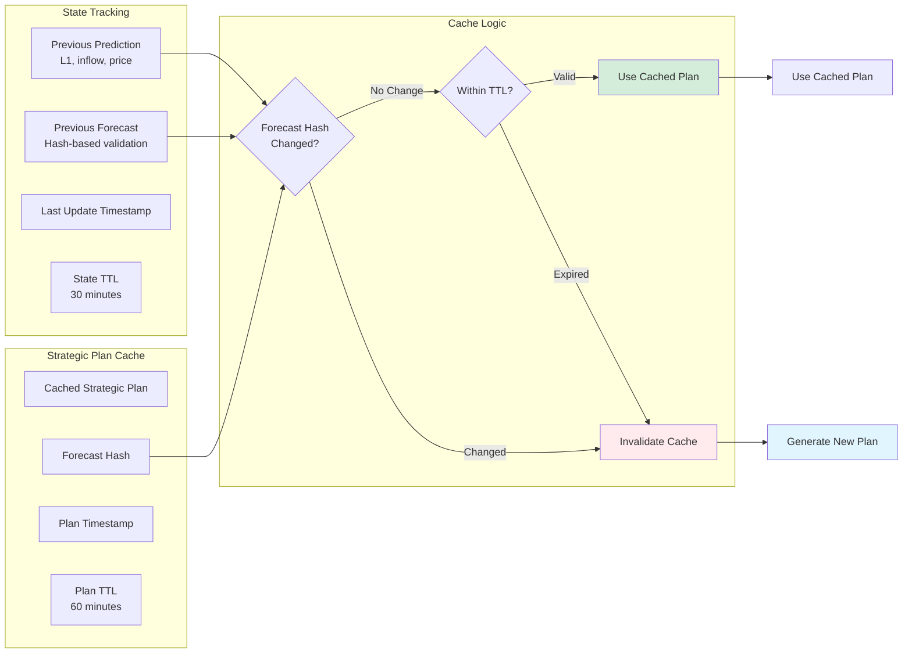

## Constraint Hierarchy

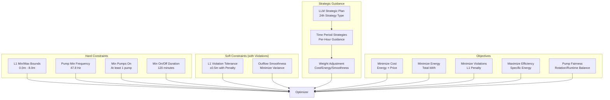

## Integration Architecture

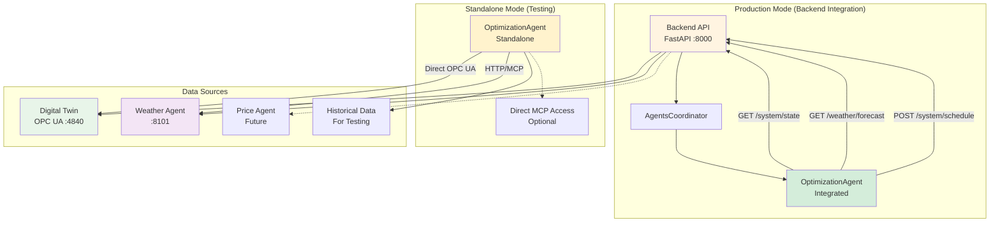

## Divergence Detection & Emergency Response

```mermaid
flowchart TD
    START[Optimization Cycle] --> GETSTATE[Get Current State]
    GETSTATE --> CHECK{Previous State<br/>Exists?}
    
    CHECK -->|No| SKIP[Skip Divergence Check<br/>Store Current State]
    CHECK -->|Yes| COMPARE[Compare Current vs Previous]
    
    COMPARE --> L1_CHECK{L1 Divergence?<br/>|L1_current - L1_predicted| > threshold}
    COMPARE --> INFLOW_CHECK{Inflow Divergence?<br/>|inflow_current - inflow_forecast| > threshold}
    COMPARE --> PRICE_CHECK{Price Divergence?<br/>|price_current - price_forecast| > threshold}
    
    L1_CHECK -->|Yes| DIVERGENCE[Divergence Detected]
    INFLOW_CHECK -->|Yes| DIVERGENCE
    PRICE_CHECK -->|Yes| DIVERGENCE
    
    DIVERGENCE --> LLM_CHECK{LLM Available?}
    LLM_CHECK -->|Yes| EMERGENCY[Generate Emergency Response<br/>via LLM]
    LLM_CHECK -->|No| ALGO[Algorithmic Emergency Response]
    
    EMERGENCY --> ADJUST[Adjust Constraints/Weights]
    ALGO --> ADJUST
    
    ADJUST --> OPTIMIZE[Run Optimization<br/>with Emergency Adjustments]
    SKIP --> OPTIMIZE
    
    OPTIMIZE --> STORE[Store Current Prediction<br/>for Next Cycle]
    STORE --> END[End]
    
    style DIVERGENCE fill:#ffebee
    style EMERGENCY fill:#fff3cd
    style ADJUST fill:#e8f5e9
```

