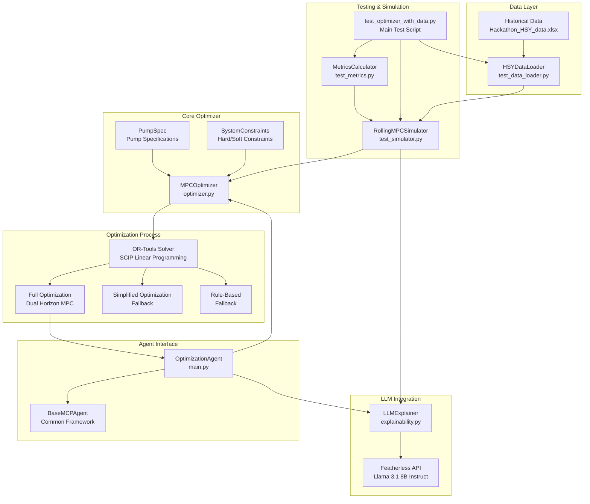
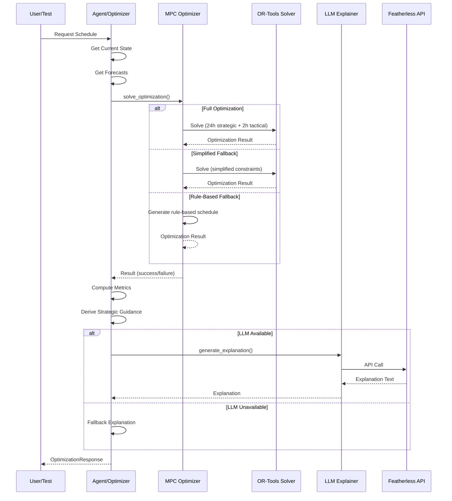
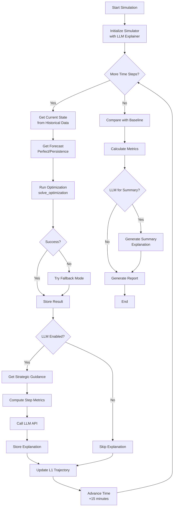
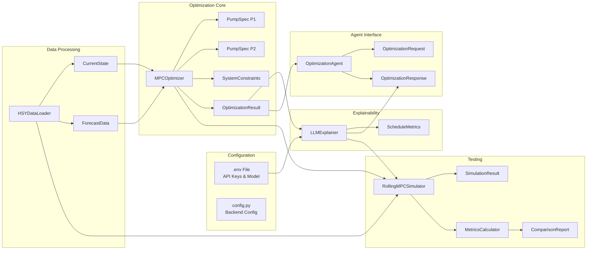
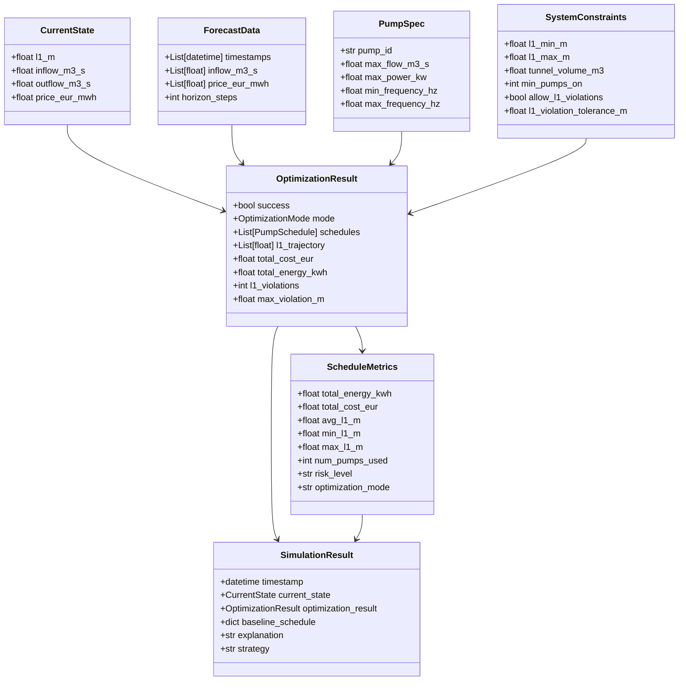
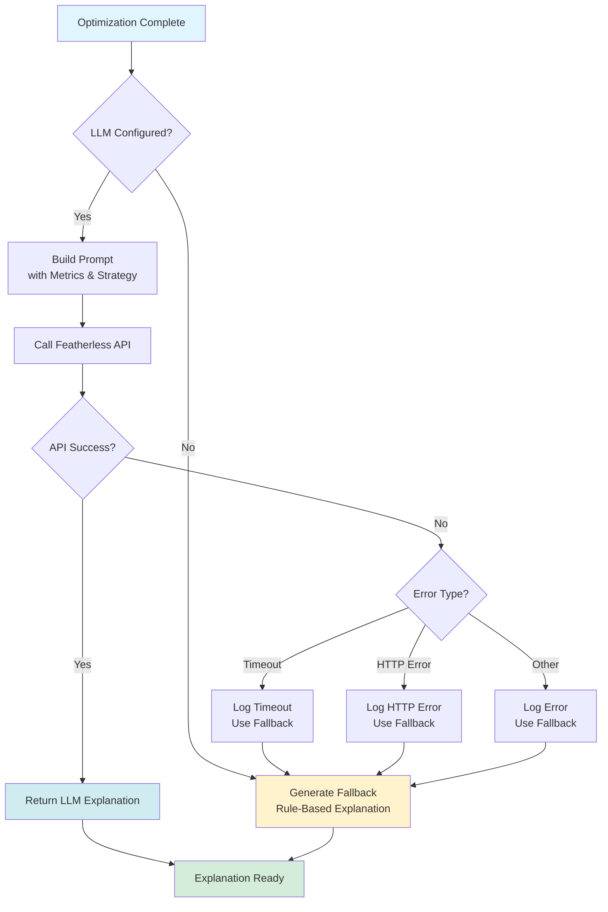

# Optimizer Agent Architecture

## System Overview



## Optimization Flow



## Rolling MPC Simulation Flow



## Component Relationships



## Data Structures



## File Structure

```
optimizer_agent/
├── main.py                    # OptimizationAgent (MCP Agent Interface)
├── optimizer.py               # MPCOptimizer (Core Optimization Engine)
├── explainability.py          # LLMExplainer (Featherless Integration)
│
├── test_data_loader.py        # HSYDataLoader (Historical Data Loading)
├── test_simulator.py          # RollingMPCSimulator (MPC Simulation)
├── test_metrics.py            # MetricsCalculator (Performance Metrics)
├── test_optimizer_with_data.py # Main Test Script
│
├── .env                       # Agent Configuration (API Keys)
└── PLAN.md                    # Implementation Plan
```

## Optimization Modes


## LLM Explanation Flow



## Constraint Hierarchy

```mermaid
graph TD
    subgraph "Hard Constraints"
        H1[L1 Min/Max Bounds<br/>0.5m - 8.0m]
        H2[Pump Min Frequency<br/>47.8 Hz]
        H3[Min Pumps On<br/>At least 1 pump]
        H4[Min On/Off Duration<br/>120 minutes]
    end
    
    subgraph "Soft Constraints (with Violations)"
        S1[L1 Violation Tolerance<br/>±0.5m with Penalty]
        S2[Outflow Smoothness<br/>Minimize Variance]
        S3[Pump Fairness<br/>Balance Operating Hours]
    end
    
    subgraph "Objectives"
        O1[Minimize Cost<br/>Energy × Price]
        O2[Minimize Energy<br/>Total kWh]
        O3[Minimize Violations<br/>L1 Penalty]
        O4[Maximize Efficiency<br/>Specific Energy]
    end
    
    H1 --> OPT[Optimizer]
    H2 --> OPT
    H3 --> OPT
    H4 --> OPT
    
    S1 --> OPT
    S2 --> OPT
    S3 --> OPT
    
    O1 --> OPT
    O2 --> OPT
    O3 --> OPT
    O4 --> OPT
```



