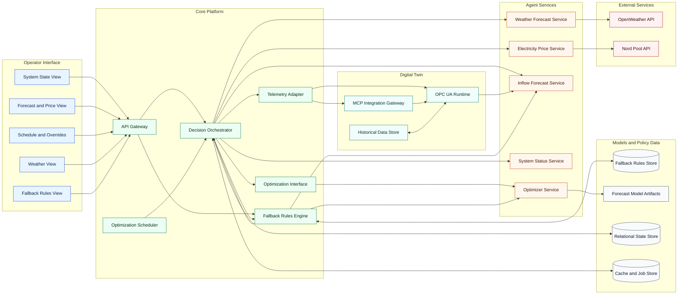

# Architecture

```mermaid
flowchart LR
  classDef ui fill:#E8F4FF,stroke:#1D4ED8,stroke-width:1px,color:#0B2545
  classDef backend fill:#ECFDF3,stroke:#047857,stroke-width:1px,color:#052E16
  classDef agent fill:#FFF7ED,stroke:#C2410C,stroke-width:1px,color:#431407
  classDef twin fill:#F0FDFA,stroke:#0F766E,stroke-width:1px,color:#042F2E
  classDef data fill:#F8FAFC,stroke:#475569,stroke-width:1px,color:#0F172A
  classDef ext fill:#FEF2F2,stroke:#B91C1C,stroke-width:1px,color:#450A0A

  subgraph UI[Operator Interface]
    P1[System State View]
    P2[Forecast and Price View]
    P3[Schedule and Overrides]
    P4[Weather View]
    P5[Fallback Rules View]
  end

  subgraph BE[Core Platform]
    API[API Gateway]
    COORD[Decision Orchestrator]
    SCHED[Optimization Scheduler]
    OPTCORE[Optimization Interface]
    RULES[Fallback Rules Engine]
    TELADP[Telemetry Adapter]
  end

  subgraph AGENTS[Agent Services]
    WA[Weather Forecast Service]
    PA[Electricity Price Service]
    IA[Inflow Forecast Service]
    SA[System Status Service]
    OA[Optimizer Service]
  end

  subgraph DATA[Models and Policy Data]
    RULESTORE[(Fallback Rules Store)]
    MODEL[Forecast Model Artifacts]
    PG[(Relational State Store)]
    REDIS[(Cache and Job Store)]
  end

  subgraph EXT[External Services]
    OWM[OpenWeather API]
    NP[Nord Pool API]
  end

  subgraph TWIN[Digital Twin]
    OPC[OPC UA Runtime]
    MCP[MCP Integration Gateway]
    HIST[Historical Data Store]
  end

  P1 --> API
  P2 --> API
  P3 --> API
  P4 --> API
  P5 --> API

  API --> COORD
  API --> RULES
  SCHED --> COORD
  COORD --> OPTCORE
  OPTCORE --> OA
  COORD --> RULES
  RULES --> COORD
  COORD --> TELADP

  COORD --> WA
  COORD --> PA
  COORD --> IA
  COORD --> SA

  TELADP --> OPC
  TELADP --> MCP
  MCP --> OPC

  HIST <--> OPC
  OPC --> IA

  OA --> MODEL
  RULES <--> RULESTORE
  RULES --> IA
  RULES --> OA

  COORD <--> PG
  COORD <--> REDIS

  WA --> OWM
  PA --> NP

  class P1,P2,P3,P4,P5 ui
  class API,COORD,SCHED,OPTCORE,RULES,TELADP backend
  class WA,PA,IA,SA,OA agent
  class OPC,MCP,HIST twin
  class RULESTORE,MODEL,PG,REDIS data
  class OWM,NP ext
```
