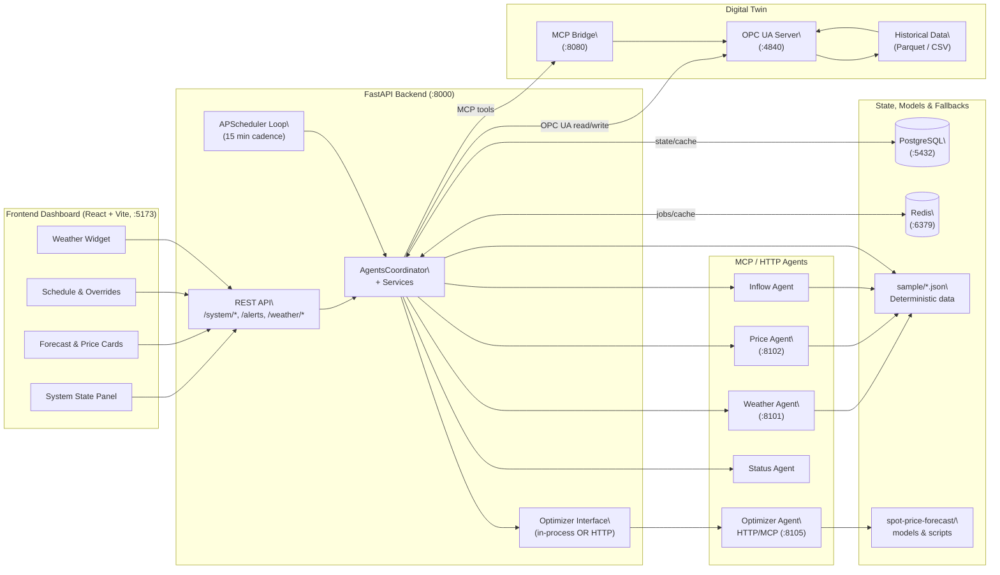
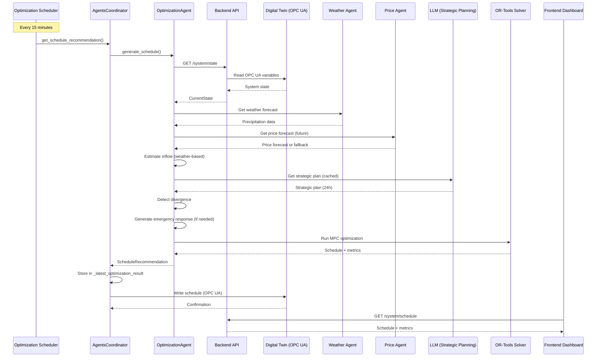
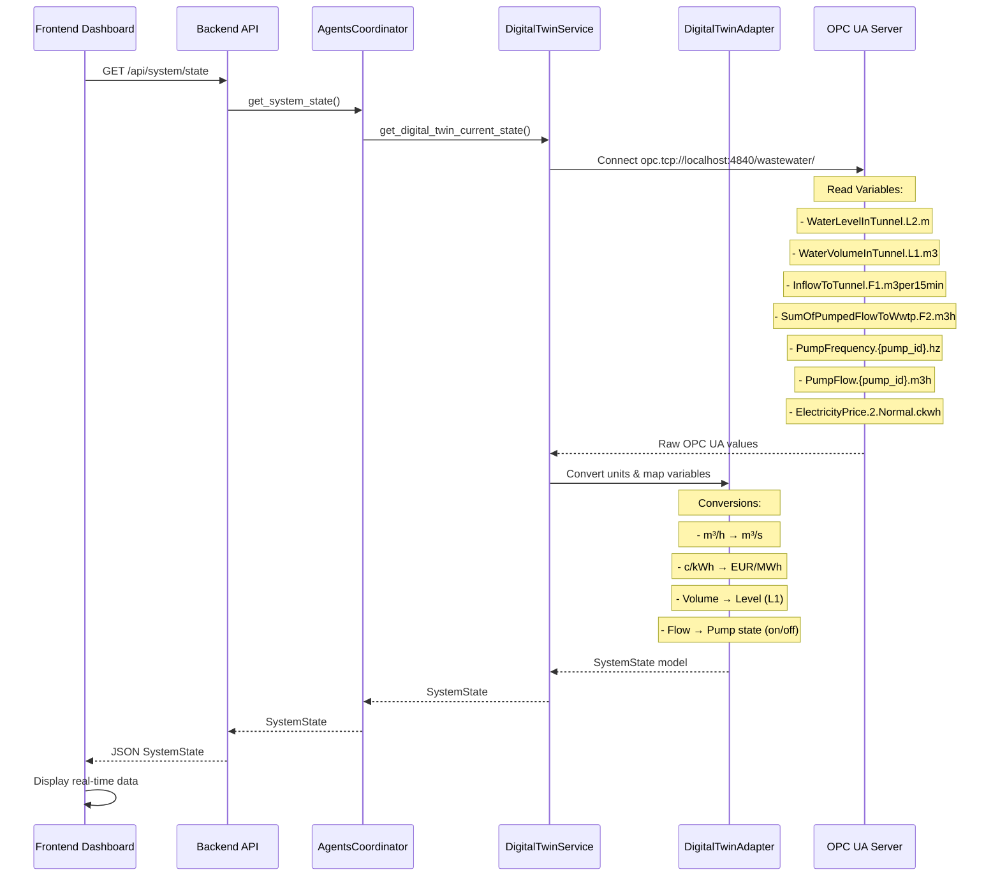
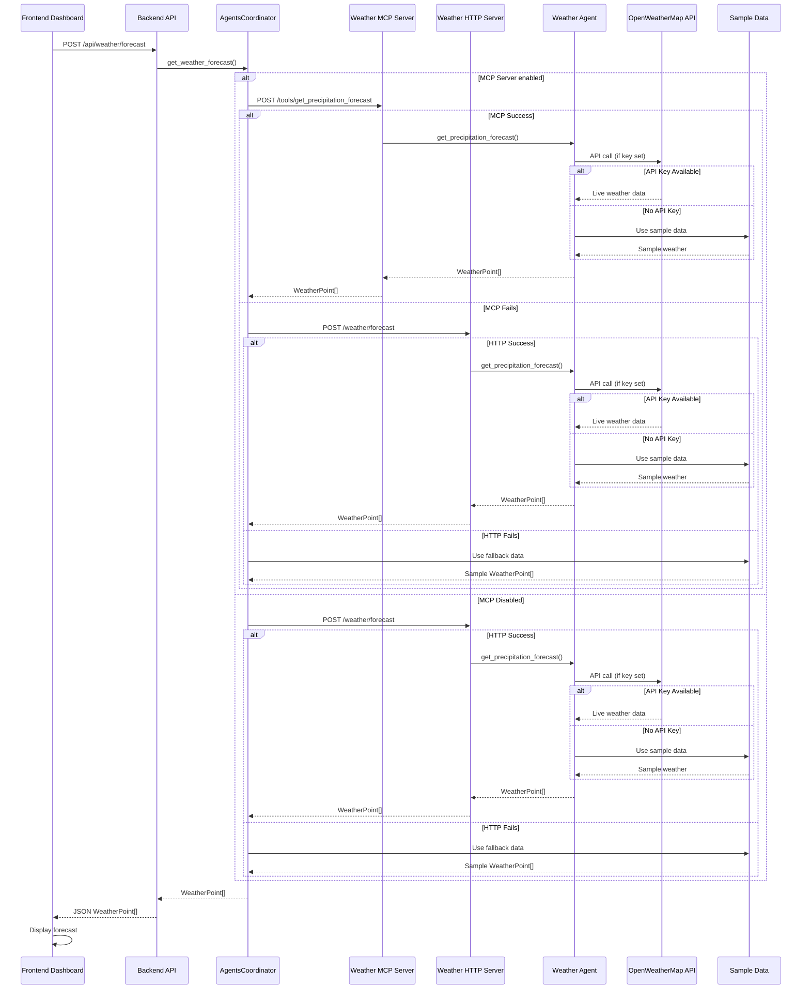
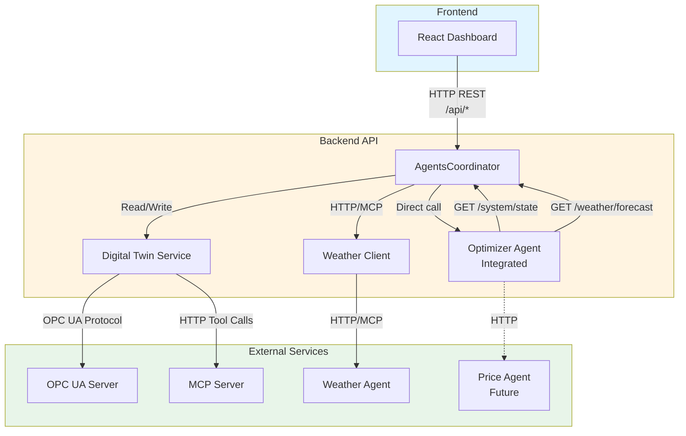
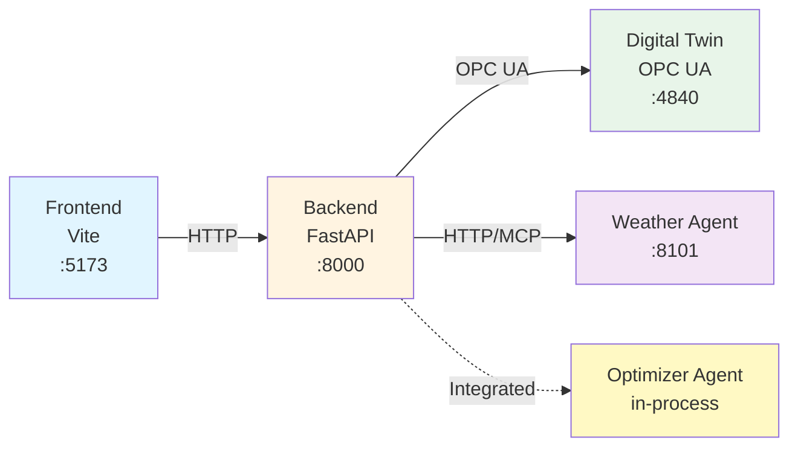
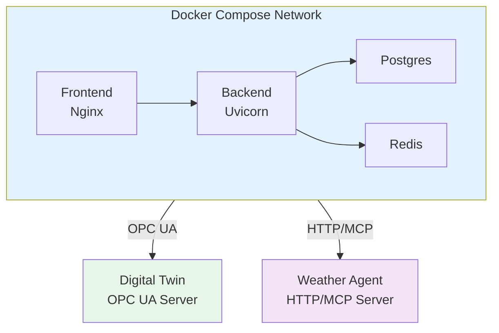

# Complete System Architecture

This document describes the full architecture of the HSY Blominmäki AI Agent Pumping Optimization System.

## High-Level Architecture



## Component Details

### 1. Frontend Dashboard

- **Technology**: React + Vite + TypeScript
- **Port**: 5173
- **Proxy**: `/api/*` → `http://localhost:8000/*`
- **Components**:
  - System Overview Card (tunnel levels, pumps, flows)
  - Forecast Panel (inflow, price forecasts)
  - Schedule Panel (optimization recommendations)
  - Weather Panel (precipitation, temperature)
  - Alerts Banner (critical warnings)

### 2. Backend API

- **Technology**: FastAPI + Python 3.12+
- **Port**: 8000
- **Key Services**:
  - `AgentsCoordinator`: Orchestrates all agents
  - `OptimizationScheduler`: Background job scheduler
  - `DigitalTwinService`: OPC UA client
  - `DigitalTwinAdapter`: Variable mapping & conversions

### 3. Optimizer Agent (Integrated)

- **Location**: Runs inside backend process
- **Technology**: OR-Tools (SCIP solver) + LLM (optional)
- **Features**:
  - MPC-style optimization (2-hour tactical horizon)
  - Strategic planning (24-hour, LLM-generated)
  - Divergence detection (L1, inflow, price)
  - Emergency response (adaptive constraints/weights)
  - Pump fairness/rotation
  - Multiple objectives (cost, smoothness, safety, efficiency)

### 4. Digital Twin

- **OPC UA Server**: Simulates wastewater system
  - Port: 4840
  - Protocol: OPC UA
  - Data: Historical HSY data (Parquet/CSV)
  - Variables: L1, L2, F1, F2, pump frequencies, prices
- **MCP Server**: Bridge to OPC UA
  - Port: 8080
  - Protocol: MCP (Server-Sent Events)
  - Tools: browse, read, write, history, aggregate

### 5. Weather Agent

- **HTTP Server**: REST API
  - Port: 8101
  - Endpoint: `/weather/forecast`
- **MCP Server**: MCP protocol
  - Port: 8101 (same port, different transport)
  - Tools: `get_precipitation_forecast`, `get_current_weather`, `check_weather_agent_health`
- **Data Source**: OpenWeatherMap API (optional, falls back to sample data)

## Data Flow

### Optimization Flow



### System State Flow



### Weather Forecast Flow



## Integration Points



### Backend ↔ Digital Twin

- **Read**: OPC UA Client → Read variables → Convert units → SystemState
- **Write**: Schedule → Convert pump IDs → Write frequencies to OPC UA
- **History**: MCP Server → Aggregate variables → Return statistics

### Backend ↔ Weather Agent

- **Primary**: HTTP endpoint (`/weather/forecast`)
- **Optional**: MCP tools (`/tools/get_precipitation_forecast`)
- **Fallback**: Sample JSON data

### Backend ↔ Optimizer Agent

- **Integrated**: Runs in same process
- **Direct calls**: `optimizer_agent.generate_schedule()`
- **Data sources**: Backend endpoints (digital twin, weather)

### Frontend ↔ Backend

- **Proxy**: Vite dev server proxies `/api/*` to `http://localhost:8000/*`
- **CORS**: Enabled for `localhost:5173` and `localhost:3000`
- **Endpoints**: All `/system/*` and `/weather/*` routes

## Configuration

### Backend Configuration (`backend/.env`)

```bash
# Digital Twin
DIGITAL_TWIN_OPCUA_URL=opc.tcp://localhost:4840/wastewater/
DIGITAL_TWIN_MCP_URL=http://localhost:8080
USE_DIGITAL_TWIN=true

# Weather Agent
USE_WEATHER_AGENT=true
WEATHER_AGENT_URL=http://localhost:8101
WEATHER_AGENT_MCP_URL=http://localhost:8101
USE_WEATHER_MCP=true
WEATHER_AGENT_LOCATION=Helsinki
OPENWEATHER_API_KEY=your-key-here

# Optimizer
OPTIMIZER_INTERVAL_MINUTES=15
BACKEND_URL=http://localhost:8000

# Scheduler
OPTIMIZER_INTERVAL_MINUTES=15
```

### Frontend Configuration (`frontend/.env.local`)

```bash
VITE_WEATHER_AGENT_URL=http://localhost:8000/weather/forecast
```

## Deployment Architecture

### Development (Local)



### Production (Docker Compose)



## Technology Stack

### Frontend

- React 18
- Vite
- TypeScript
- React Query (data fetching)
- Tailwind CSS
- Recharts (visualization)

### Backend

- FastAPI
- Python 3.12+
- APScheduler (background jobs)
- Pydantic (data validation)
- httpx (HTTP client)
- opcua (OPC UA client)

### Optimizer Agent

- OR-Tools (SCIP solver)
- NumPy, Pandas (data processing)
- LLM (optional, for strategic planning)

### Digital Twin

- OPC UA Server (python-opcua)
- MCP Server (FastMCP)
- SQLite (historical data storage)
- Pandas (data processing)

### Weather Agent

- FastAPI (HTTP server)
- FastMCP (MCP server)
- httpx (OpenWeatherMap client)

## Data Models

### SystemState

```python
{
  "timestamp": datetime,
  "tunnel_level_m": float,        # L1 (from volume)
  "tunnel_level_l2_m": float,     # L2
  "tunnel_water_volume_l1_m3": float,
  "inflow_m3_s": float,           # F1
  "outflow_m3_s": float,           # F2
  "electricity_price_eur_mwh": float,
  "pumps": [
    {
      "pump_id": "1.1",
      "state": "on" | "off",
      "frequency_hz": float,
      "power_kw": float
    }
  ]
}
```

### ScheduleRecommendation

```python
{
  "generated_at": datetime,
  "horizon_minutes": int,
  "entries": [
    {
      "pump_id": "1.1",
      "target_frequency_hz": float,
      "start_time": datetime,
      "end_time": datetime
    }
  ],
  "justification": str
}
```

### OptimizationMetrics

```python
{
  "generated_at": str,
  "total_cost_eur": float,
  "total_energy_kwh": float,
  "optimization_mode": "full" | "safety" | "cost",
  "horizon_minutes": int
}
```

## Communication Protocols

### HTTP REST API

- **Backend ↔ Frontend**: JSON over HTTP
- **Backend ↔ Weather Agent**: JSON over HTTP
- **Backend ↔ Digital Twin MCP**: JSON over HTTP (tool calls)

### OPC UA

- **Backend ↔ Digital Twin**: OPC UA protocol
- **Variables**: Read/Write operations
- **History**: Historical data queries

### MCP (Model Context Protocol)

- **Digital Twin MCP Server**: SSE transport
- **Weather Agent MCP Server**: SSE transport
- **Tool-based**: Browse, read, write, aggregate operations

## Error Handling & Fallbacks

### Digital Twin Unavailable

1. Backend logs warning
2. Falls back to synthetic system state
3. Dashboard still works (shows stub data)

### Weather Agent Unavailable

1. Backend tries MCP, then HTTP
2. Falls back to sample weather data
3. Optimization continues (uses fallback forecasts)

### Optimizer Agent Unavailable

1. Backend logs warning
2. Falls back to stub schedule
3. Dashboard still works (shows stub schedule)

### Network Failures

- All HTTP calls have timeouts
- Graceful degradation at each layer
- Logging for debugging

## Security Considerations

- **CORS**: Configured for development (localhost only)
- **API Keys**: Environment variables (not in code)
- **OPC UA**: Local network only (not exposed externally)
- **Validation**: Pydantic models validate all inputs

## Performance

- **Optimization**: Runs every 15 minutes (configurable)
- **State Updates**: Dashboard polls every 30 seconds
- **Forecasts**: Cached for 5 minutes
- **Strategic Plan**: Cached for 1 hour (if forecasts stable)

## Future Extensions

- **Price Agent**: Integrate Nord Pool API
- **Inflow Agent**: Enhance with ML models
- **Electricity Agent**: Real-time grid data
- **WebSocket**: Real-time updates (replace polling)
- **Persistence**: Store schedules in Postgres
- **Analytics**: Historical optimization performance
